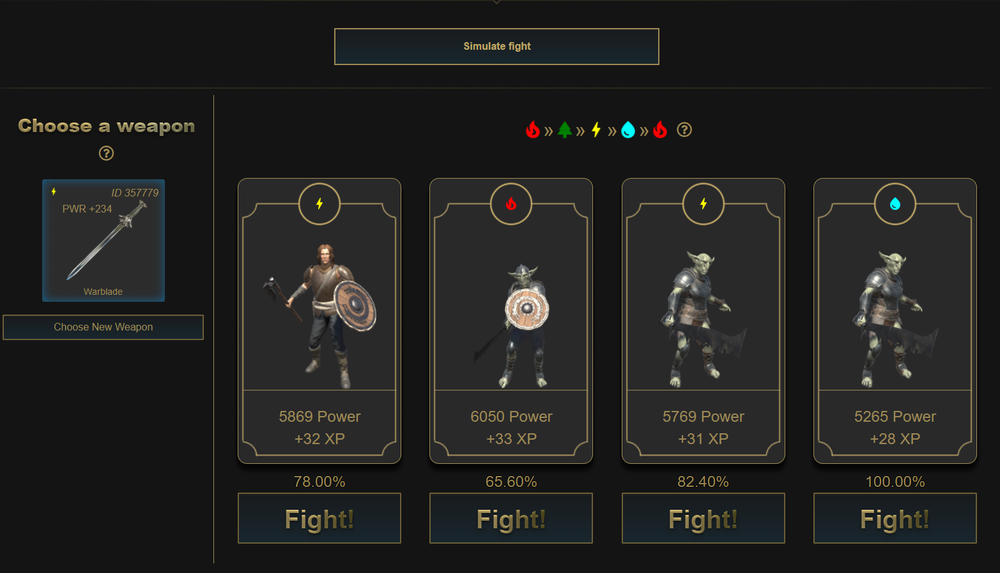
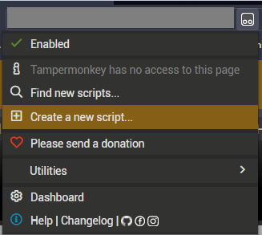
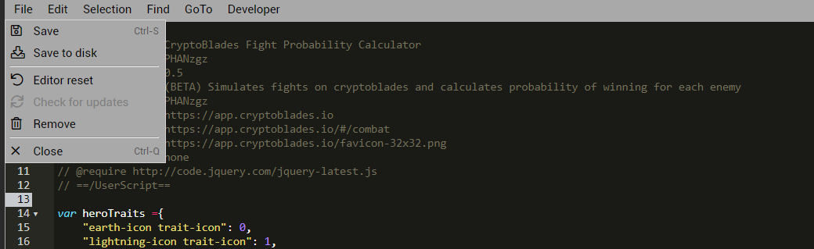
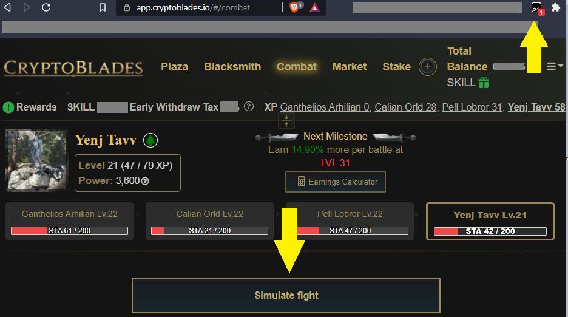

# Cryptoblades Fight Probability Calculator 

> This script is currently in BETA. It may stop working at any point in time. Please DM me on Discord if you find any bugs `#PHAN3179`  

# Win always, with just the click of a button

This script substitutes the "Very Likely" and similar for the exact probability of winning inside CryptoBlades. Just click the 
"Simulate Fight" button to display them. As simple as that. Now you can always make the best choice to earn max profits.

Please consider sending me some coffe at `0x10A5666d9A137E50f19E85643bD929BdCad69de1` (BSC, ETH, Polygon) if you found this helpful.

# How to install

### 1. Install Tampermonkey on Chrome or Brave

### 2. Click the extension icon and select create new script

### 3. Copy the contents of [CryptoBladesCalculatorScript.js](CryptoBladesCalculatorScript.js) and paste them on the editor you just opened

Remember to save the script (File -> Save)

### 4. If everything went OK, you should see the script running and the button on the next refresh inside the cryptoblades webpage

Finally, go to combat, select a weapon and click the button. You should now see the probability of winning for each enemy, as shown in the first image.
